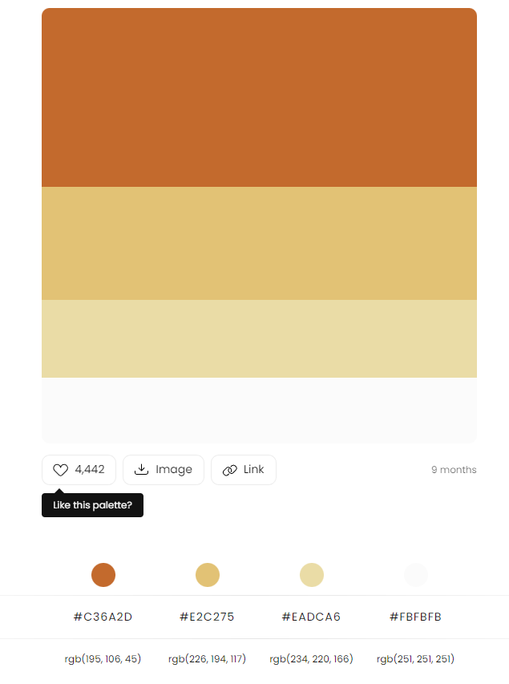

# Godoy-Acordes
## Venta y reparación de instrumentos musicales
### Variedad de productos de las mejores marcas, servicio de luthería y asistencia. 

#### Temática del e-commerce
Este e-commerce a modo práctico sería una página de venta de instrumentos musicales. 
Cuenta con productos separados por tipo, marca, con precio, carrito, compras online.
También se ofrecería **servicio de asistencia**  con instrumentos y luthería (reparación) por diferentes medios de contacto.

#### Público objetivo
el Público objetivo es variado, ya sea músicos profesionales o cualquier persona interesada por aprender música y conseguir su primer instrumento. 

#### Tipografía Principal

**font-family: 'Kdam Thmor Pro'**

Se eligió esta tipografía como principal para los textos de la página.

**font-family: 'Cuprum', sans-serif;**

Se eligió esta fuente para el nombre de la página, intercambiable por logo en algún otro diseño. 

#### Paleta de colores

https://colorhunt.co/palette/c36a2de2c275eadca6fbfbfb

Se eligió esta paleta de colores buscando ir con tonalidades en color madera y dorado, colores comunes en las familias de instrumentos musicales.  ***Colores armónicos*** para acompañar la calidez de la música. 

#### Creación de logo

El logo representa el nombre de la empresa, con fuente redondeada simulando curvas de clave de sol y adorno de mástiles de guitarra formando un corazón, denotando amor por la música. 

